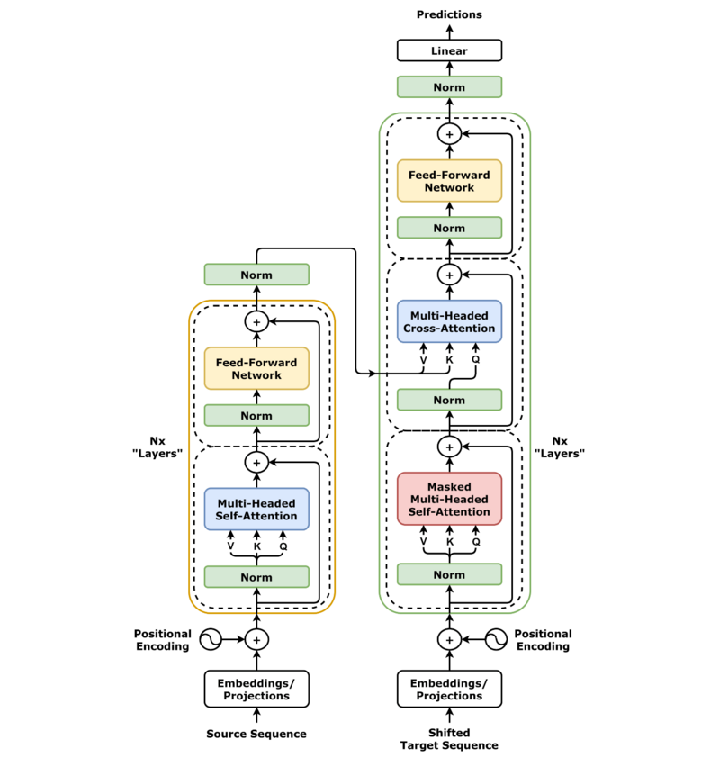

## Intro:

This section is based on [Transformers from Scratch by CodeEmporium](https://youtu.be/QCJQG4DuHT0?si=SMsIKsiFlmP-dtez).

## 1. Takeaways:

### 1.1 Background:

RNNs were previously the state of the art for sequential modelling. (Sequence to Sequence). 
RNNs have 3 main issues:
* Too slow (need to feed inputs one at a time to generate outputs sequentially)
* Training is slow too [truncated version of backpropagation called truncated backpropagation through time (TBPTT) ]
* The hidden state vectors might not truly represent the context[Vanilla RNN receive signals from only inputs before it whereas bi-directional RNNs look through sequences "left to right", "right to left" and blindly concatenate them so there is no guarantee that ideal representation is achieved]

### 1.2 Attention:

A better representation of context is achieved through attention. Attention mechanism allows a NN to focus on specific parts of the input sequence by assigning weights to different parts of the sequence with the most important parts receiving the highest weights.

Self Attention: Self-attention enables a model to attend to different positions of its input sequence to compute a representation of that sequence.

Multi-head attention: Multi-head attention is an extension of the self-attention mechanism. It enhances the model's ability to capture diverse contextual information by simultaneously attending to different parts of the input sequence. 

https://www.baeldung.com/cs/attention-luong-vs-bahdanau
https://wikidocs.net/book/14969

### 1.3 Transformers

Transformers contain this attention blocks at its crux. Its architecture is as shown below.
<!--  -->

    

Input sequences are broken down into chunks for processing and converted into vectors. These are then positionally encoded and passed through attention mechanism in the encoding phase.

During Encoding phase, goal of attention is to generate high-quality vectors.

### 1.4 How does transformer architecture overcome disadvantages in RNNs?
* RNNs have slow training due to sequential inputs and sequential outputs while transformers can parallelize them.
* Vectors in Transformers are better context aware than those in RNNs due to attention mechanism

### 1.5 Attention in Transformer architecture

Every input to a transformer model have 3 vectors:
Query [Q]: What am I looking for?
Key   [K]: What can I offer?
Value [V]: What I actually offer?

For Self Attention, we see if every word/input of the input sequence has high affinity with every other vector.

### 1.6 [Transformer Visualisation](https://poloclub.github.io/ransformer-explainer)

